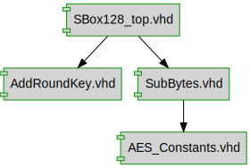

# Documentation for: AES_Sbox

# Build the Xilinx ISE project by running

```shell
$ cd ss_aes_ise
$ xtclsh SBox128_encryption_SS1.tcl rebuild_project
```



## Designs

- Module: [SBox128_top ](./doc/SBox128_top.md)
- Module: [AddRoundKey ](./doc/AddRoundKey.md)
- Package: [AES_CONSTANTS ](./doc/AES_Constants.md)
- Module: [SubBytes ](./doc/SubBytes.md)

