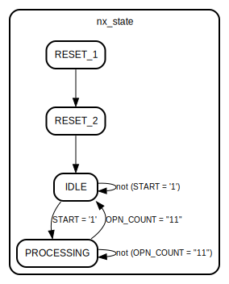

# Entity: SBox128_top 

- **File**: SBox128_top.vhd
## Diagram

## Ports

| Port name      | Direction | Type                            | Description |
| -------------- | --------- | ------------------------------- | ----------- |
| SYS_CLK        | in        | std_logic                       |             |
| RST            | in        | std_logic                       |             |
| PLAINTEXT_IN   | in        | std_logic_vector (127 downto 0) |             |
| KEY_IN         | in        | std_logic_vector (127 downto 0) |             |
| START          | in        | std_logic                       |             |
| KEY_LOAD       | in        | std_logic                       |             |
| DONE           | out       | std_logic                       |             |
| BUSY           | out       | std_logic                       |             |
| CIPHERTEXT_OUT | out       | std_logic_vector (127 downto 0) |             |
## Signals

| Name                | Type                           | Description |
| ------------------- | ------------------------------ | ----------- |
| pr_state            | state                          |             |
| nx_state            | state                          |             |
| RST_BUF             | std_logic                      |             |
| BUSY_BUF            | std_logic                      |             |
| PLAINTEXT_BUFFER    | std_logic_vector(127 downto 0) |             |
| OPN_COUNT           | std_logic_vector(1 downto 0)   |             |
| KEY_BUF             | std_logic_vector(127 downto 0) |             |
| SubBytes_IN_BUF     | std_logic_vector(127 downto 0) |             |
| SubBytes_OUT_BUF    | std_logic_vector(127 downto 0) |             |
| AddRoundKey_IN_BUF  | std_logic_vector(127 downto 0) |             |
| AddRoundKey_OUT_BUF | std_logic_vector(127 downto 0) |             |
## Types

| Name  | Type                                                                                                                                             | Description |
| ----- | ------------------------------------------------------------------------------------------------------------------------------------------------ | ----------- |
| state | (RESET_1,  RESET_2,  IDLE,  PROCESSING) |             |
## Processes
- STATE_MACHINE_HEAD: ( SYS_CLK )
- STATE_MACHINE_BODY: ( START, OPN_COUNT, pr_state )
- PLAINTEXT_INPUT_REGISTER: ( SYS_CLK )
- MASTER_KEY_REGISTER: ( SYS_CLK )
- CIPHER_TEXT_OUTPUT_REGISTER: ( SYS_CLK )
- OPERATIONS_COUNTER: ( SYS_CLK )
- ENCRYPT_DONE_SIGNAL_LATCH: ( SYS_CLK )
- BUSY_OUTPUT_MUX: ( BUSY_BUF, pr_state )
## Instantiations

- INST_SubBytes: SubBytes
- INST_AddRoundKey: AddRoundKey
## State machines

